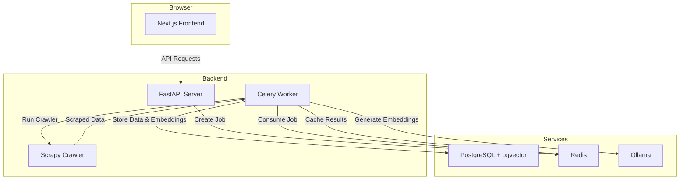

# Asynchronous Web Crawler and Semantic Search Engine

This project is a powerful and scalable web crawling system designed to fetch, process, and index web content for semantic search. It uses an asynchronous, message-driven architecture with Celery, Redis and Scrapy for crawling.

## Architecture

The application is composed of several services that work together to provide a scalable and resilient system.



### Components

*   **Next.js Frontend**: A modern, user-friendly interface for managing and monitoring crawling jobs.
*   **FastAPI Server**: A Python-based backend that provides a RESTful API for interacting with the system.
*   **Celery Worker**: A distributed task queue that handles asynchronous tasks like running crawlers and processing data.
*   **Scrapy Crawler**: A powerful and flexible web crawling framework used to fetch web content.
*   **PostgreSQL + pgvector**: A relational database with vector support for storing and querying structured data and semantic embeddings.
*   **Redis**: An in-memory data store used as a Celery message broker and for storing task results and as a cache.
*   **Ollama**: A service for running large language models locally, used to generate vector embeddings for semantic search. The system uses `llama3.2` for text and `llava` for images.


## Features

*   **Asynchronous Crawling**: Utilizes Celery and Redis to manage crawling jobs, allowing for non-blocking operations and easy scalability.
*   **Multi-Content Support**: In addition to HTML, the crawler can process and index PDF documents and images.
*   **Semantic Search**: Leverages vector embeddings (via `pgvector`) to provide intelligent, meaning-based search over the crawled data.
*   **Interactive Chat UI**: A new chat interface, built with the Vercel AI SDK, allows you to have a conversation with your crawled data. Using a Retrieval-Augmented Generation (RAG) model, you can ask questions and get answers directly from the content of your indexed web pages, PDFs, and images.
*   **Multimodal Embeddings**: Generates both text embeddings (for HTML/PDF) and vision embeddings (for images) using state-of-the-art models.
*   **Modern Frontend**: A Next.js and Shadcn UI-based frontend provides a user-friendly interface to manage and monitor crawling jobs.
*   **Dockerized Infrastructure**: Core dependencies like PostgreSQL, Redis, and Ollama are managed with Docker, ensuring a consistent and easy-to-set-up environment.
*   **Database Migrations**: Uses Alembic to manage database schema changes in a structured and version-controlled way.
*   **RESTful API**: A FastAPI-based API provides endpoints to start, stop, and monitor crawlers, as well as perform searches.

## Supported Content Types

The crawler can process the following content types:

| Content Type | Description | Embedding Model |
| :--- | :--- | :--- |
| **HTML** | Standard web pages. | `llama3.2:latest` (Text) |
| **PDF** | PDF documents. Text is extracted using `PyMuPDF`. | `llama3.2:latest` (Text) |
| **Images** | Common image formats (PNG, JPG, etc.). | `llava:latest` (Vision) |


## Directory Structure

```
.
├── alembic.ini
├── docker-compose.yml
├── package.json
├── backend
│   ├── .env.example
│   ├── requirements.txt
│   ├── alembic/
│   └── src/
│       ├── main.py
│       ├── models.py
│       └── ...
└── frontend/
    ├── package.json
    ├── next.config.ts
    └── src/
        ├── app/
        ├── components/
        └── services/
```

## How to Run Locally

### Prerequisites

*   [Docker](https://www.docker.com/get-started) and [Docker Compose](https://docs.docker.com/compose/install/)
*   [Node.js and npm](https://nodejs.org/en/download/)
*   [Conda](https://docs.conda.io/projects/conda/en/latest/user-guide/install/index.html) (for managing the Python environment)

### 1. Clone the Repository

```bash
git clone <repository-url>
cd <repository-name>
```

### 2. Set Up Environment Variables

Create a `.env` file in the `backend/` directory by copying the example file.

```bash
cp backend/.env.example backend/.env
```

The default values are configured to work with the `docker-compose.yml` file.

### 3. Set Up Python Environment

This project uses a Conda environment to manage Python dependencies.

```bash
# Create and activate the conda environment
conda create -n crawler python=3.12 -y
conda activate crawler

# Install the required python packages
pip install -r backend/requirements.txt
```

### 4. Start Services and Run Migrations

These commands will start the Docker containers and then apply the database migrations.

```bash
# Start Docker containers (Postgres, Redis, Ollama)
npm run docker:up

# Apply database migrations
npm run db:up
```

### 5. Run the Application

#### Backend

Start the FastAPI application using Uvicorn.

```bash
conda run -n crawler uvicorn src.main:app --host 0.0.0.0 --port 5000 --reload
```

The backend will be running at `http://localhost:5000`.

#### Celery Worker

In a separate terminal, start the Celery worker.

```bash
conda run -n crawler celery -A src.celery_app worker --loglevel=info
```

#### Frontend

In a separate terminal, start the Next.js frontend.

```bash
cd frontend
npm install
npm run dev
```

The frontend will be running at `http://localhost:3000`.

## API Documentation

The API is built with FastAPI, which provides automatic, interactive documentation. Once the backend server is running, you can access the documentation at:

*   **Swagger UI**: [http://localhost:5000/docs](http://localhost:5000/docs)
*   **ReDoc**: [http://localhost:5000/redoc](http://localhost:5000/redoc)

These interfaces allow you to explore and test all the available API endpoints directly from your browser.

## Database Migrations

This project uses Alembic to handle database schema migrations.

### Creating a New Migration

When you make changes to the SQLAlchemy models in `backend/src/models.py`, you'll need to generate a new migration script.

1.  **Generate the migration script**:
    ```bash
    npm run db:new-migration -- -m "Your descriptive migration message"
    ```
    *Note the `--` which is required to pass arguments to the underlying script.*

2.  **Review the script**: A new file will be created in `backend/alembic/versions/`. Open this file and review the generated code to ensure it's correct.

3.  **Apply the migration**:
    ```bash
    npm run db:up
    ```

### Downgrading a Migration

To revert the last migration, use the `db:down` command:

```bash
npm run db:down
```

## Observability

The project is configured with a comprehensive observability stack to provide insights into the application's performance, logs, and traces. The stack includes Grafana, Loki, Prometheus, and Jaeger.

### Accessing the UIs

*   **Grafana**: [http://localhost:3001](http://localhost:3001)
    *   **Credentials**: `admin` / `admin`
*   **Loki**: Logs are queried through Grafana.
*   **Prometheus**: [http://localhost:9090](http://localhost:9090)
*   **Jaeger**: [http://localhost:16686](http://localhost:16686)

### Viewing Logs in Grafana

1.  Navigate to the Grafana UI.
2.  On the left-hand menu, go to **Explore**.
3.  Select the **Loki** data source from the dropdown at the top.
4.  Use the **Log browser** to build a query. For example, to see logs from the `fastapi_app` service, you can use the query `{compose_service="crawler_fastapi_app"}`.

### Creating Alerts in Grafana

Grafana allows you to create alerts based on log patterns or metrics.

1.  **Create a new dashboard panel**:
    *   Go to **Dashboards** > **New dashboard**.
    *   Add a new panel and select the **Loki** or **Prometheus** data source.
2.  **Define the query**:
    *   Write a query that returns the data you want to alert on. For example, a query to count errors in the `fastapi_app` logs: `count_over_time({compose_service="crawler_fastapi_app"} |= "ERROR" [5m])`
3.  **Create the alert rule**:
    *   In the panel settings, go to the **Alert** tab.
    *   Click **Create alert rule** and configure the conditions, evaluation interval, and notification channels.

## Debugging

Here are some common issues and how to resolve them:

### Celery/Redis Issues

*   **Check the logs**: Use `docker logs <celery-worker-container-name>` and `docker logs <redis-container-name>` to check for any errors.
*   **Memory allocation**: Ensure that the Redis container has enough memory allocated to it.
*   **Authentication**: Verify that the credentials in your `.env` file are correct.

### Database Errors

*   **Migrations not run**: Ensure that you have run `npm run db:up` after any changes to the database models.
*   **Database corruption**: If you suspect the database is in a bad state, you can reset it by running:
    ```bash
    npm run docker:down
    # Remove the postgres volume to delete all data
    docker volume rm <project-name>_postgres_data
    npm run docker:up
    npm run db:up
    ```

### Ollama and Llama Issues

*   **Check Ollama logs**: Use `docker logs <ollama-container-name>` to see if the service is running correctly.
*   **Model not pulled**: Ensure that the `llama3.2:latest` and `llava:latest` models have been pulled correctly by Ollama. You can check the logs for messages related to model pulling.

## Contributing

Contributions are welcome! Please follow these steps to contribute:

1.  **Fork the repository**.
2.  **Create a new branch**: `git checkout -b my-feature-branch`
3.  **Make your changes**: Ensure that you follow the existing coding standards and write clean, well-documented code.
4.  **Commit your changes**: `git commit -m "Add some feature"`
5.  **Push to the branch**: `git push origin my-feature-branch`
6.  **Create a new Pull Request**.